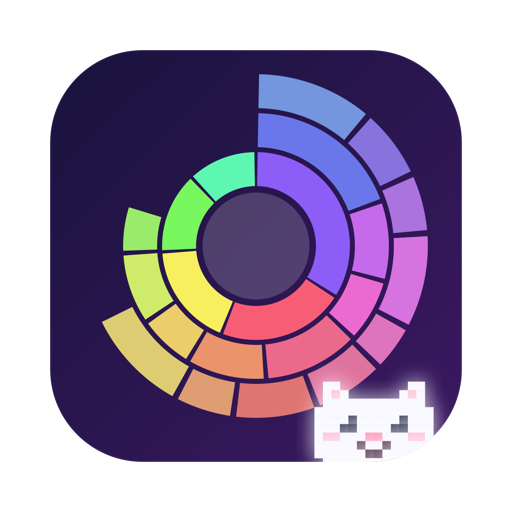
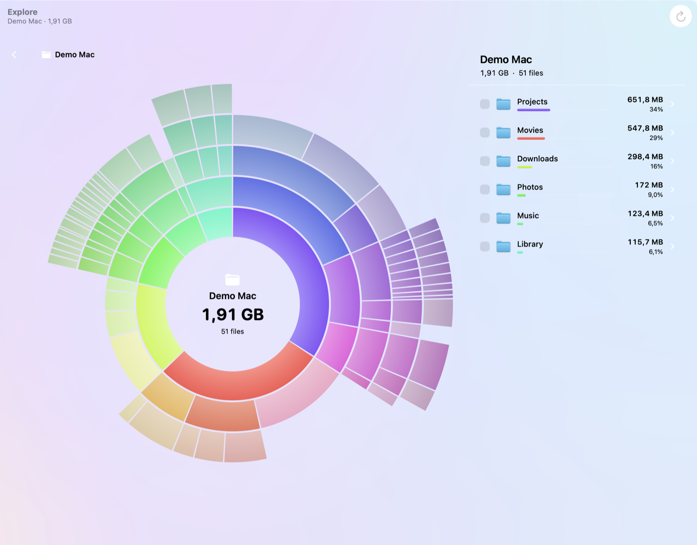
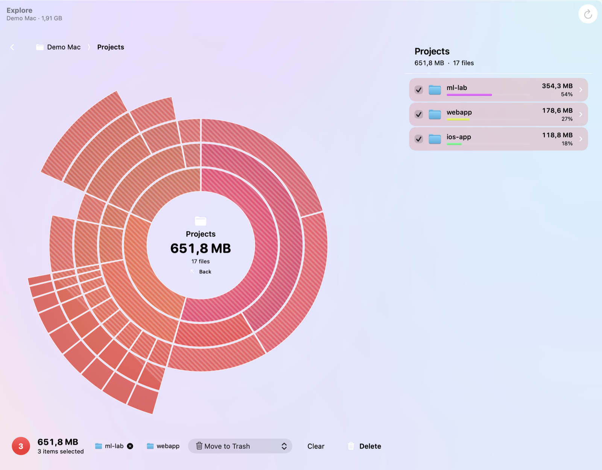
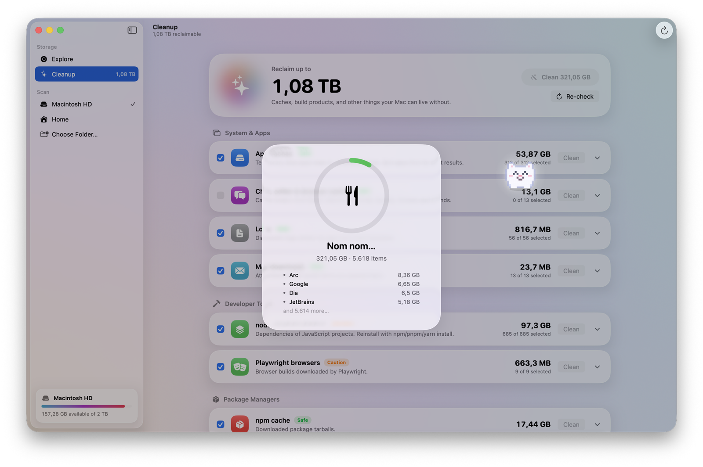
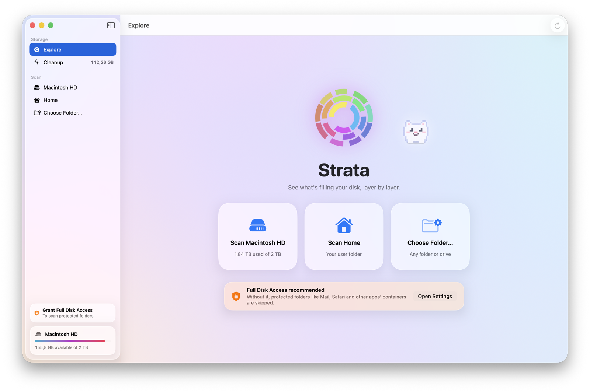

<div align="center">



# Strata

**See what's filling your disk, layer by layer.**

A native macOS app that scans your whole drive, draws it as an interactive sunburst,
and lets you clean up with a safety countdown — guided by Nibble, a tiny glowing pixel cat
who eats everything you delete.


</div>

<br>



## What it does

- **Scans everything, fast.** A work-stealing scanner walks the disk on every core with raw `readdir`/`fstatat` calls — about 12 million files in a few minutes — counting real allocated bytes and each hard link once.
- **Shows it as layers.** Every ring is one level deeper. Click a segment to zoom in, click the center to go back. Colors follow the circle, so zoom transitions stay smooth and continuous.
- **Deletes safely.** Tick items (or ⌘-click a segment), press Delete, and you get **5 seconds to change your mind** before anything is touched. Choose *Move to Trash* or *Delete Permanently*. System folders can't be selected at all.
- **Recommends cleanups.** A second tab measures the usual suspects — app caches, Xcode DerivedData and simulators, npm/pnpm/bun/pip/uv/cargo/Go/Gradle caches, Homebrew, Docker images and volumes, stray `node_modules`, forgotten installers and huge files — each tagged **Safe**, **Caution** or **Review**.
- **Has a friend.** Nibble trails your cursor from a polite distance, hops when you click, narrates what's going on, falls asleep when you're idle, and munches on every file you delete. <kbd>⌘</kbd><kbd>⇧</kbd><kbd>M</kbd> hides it.

<table>
  <tr>
    <td></td>
    <td></td>
  </tr>
  <tr>
    <td align="center"><sub>Pick what to delete — selected layers turn striped red</sub></td>
    <td align="center"><sub>Cleanup recommendations, with Nibble mid-meal</sub></td>
  </tr>
</table>



## Getting started

Requires **macOS 26 (Tahoe)** and **Xcode 26**. The project is generated with [XcodeGen](https://github.com/yonaskolb/XcodeGen).

```sh
brew install xcodegen
git clone https://github.com/coupez/strata.git
cd strata
./scripts/build.sh
open build/Strata.app
```

For a complete picture, give Strata **Full Disk Access** in *System Settings → Privacy & Security*. Without it, protected folders (Mail, Safari, other apps' containers) are skipped. The app links you there if access is missing.

## How it works

| Piece | Where | Notes |
| --- | --- | --- |
| Scanner | [`Scanner.swift`](Sources/Model/Scanner.swift) | Each directory is a job on a shared queue, so one giant subtree still uses every core. Firmlinks and other volumes are skipped so nothing is counted twice. Files under 256 KB are folded into one "smaller files" node per folder to keep memory low. |
| Sunburst | [`Sunburst.swift`](Sources/Views/Sunburst.swift) | A single `Canvas`. Zooming maps the old layout into the new one and animates between them, instead of cross-fading. |
| Deletion | [`Deletion.swift`](Sources/Model/Deletion.swift) | 5-second countdown, then a background pool removes up to 6 items at once. Progress is measured in bytes (and live free space), not item count. |
| Cleanup | [`Cleanup.swift`](Sources/Model/Cleanup.swift) | Each recommendation is either a set of paths to remove or a tool's own cleanup command (`brew cleanup`, `docker system prune`, `simctl delete unavailable`…). |
| Nibble | [`Mascot.swift`](Sources/Views/Mascot.swift) | A 16×14 pixel sprite with a spring-physics follower, drawn in a `TimelineView` overlay that never blocks clicks. |

## Safety

Strata deletes real files. It tries hard to make that deliberate:

- Nothing happens until the 5-second countdown finishes. Cancel with the button or <kbd>Esc</kbd>.
- `/System`, `/usr`, `/bin`, your home folder itself, `~/Library`, `~/Documents` and similar can never be selected.
- Cleanup items marked **Caution** or **Review** are never pre-selected.

Still: have a backup, and read what you've selected before pressing Delete.

## License

[MIT](LICENSE)
